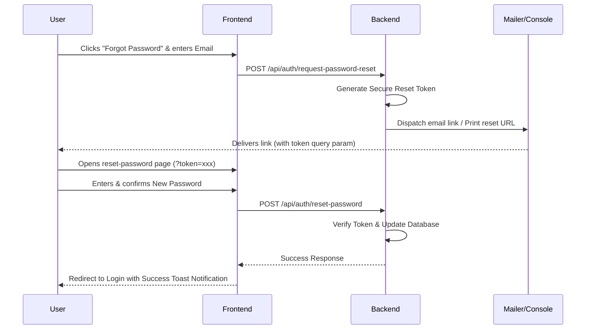

# 🎓 Classroom & College Management Dashboard

A modern, full-stack college classroom and department management platform. This system streamlines course coordination, faculty and student listing, enrollment tracking, department stats, and secure role-based access control.

The project is structured as a split codebase consisting of a robust Express-based API backend and a dynamic, high-performance React frontend.

---

## 🏗️ Architecture Overview

The workspace is divided into two primary workspaces:

```
College_Dashboard/
├── classroom-backend/     # Express API Server (Node.js, Better Auth, Drizzle ORM, PostgreSQL)
└── classroom-frontend/    # Client Dashboard (React, Refine, Vite, Tailwind CSS)
```

---

## ⚡ Tech Stack

### Frontend Components
*   **Framework**: [Vite](https://vite.dev/) + [React 19](https://react.dev/)
*   **Admin Panel Core**: [Refine](https://refine.dev/) (enterprise-grade data-hook framework)
*   **Styling**: [Tailwind CSS v4](https://tailwindcss.com/) + Custom Glassmorphism Theme
*   **Routing**: [React Router v7](https://reactrouter.com/)
*   **Form Management**: [React Hook Form](https://react-hook-form.com/) + [Zod Schema Validation](https://zod.dev/)
*   **Component Library**: [shadcn/ui](https://ui.shadcn.com/) (Radix primitives)
*   **Icons**: [Lucide React](https://lucide.dev/)

### Backend Services
*   **Server Platform**: [Node.js](https://nodejs.org/) + [Express](https://expressjs.com/)
*   **Authentication**: [Better Auth](https://www.better-auth.com/) (Session management, OAuth, Forgot/Reset Flows)
*   **Database ORM**: [Drizzle ORM](https://orm.drizzle.team/)
*   **Database**: [Neon Serverless PostgreSQL](https://neon.tech/)
*   **Security & Protection**: [Arcjet](https://arcjet.com/) (Rate-limiting & API shields)
*   **Mailer**: [Nodemailer](https://nodemailer.com/)

---

## 🌟 Core Features

-   🔑 **Role-Based Authentication**: Role-based access control (Student vs. Faculty/Admin) managed via Better Auth.
-   🌐 **Social Logins**: OAuth integration with Google and GitHub.
-   🔄 **Password Recovery**: Secure forgot password and email-based/token-based password reset flows.
-   📊 **Interactive Dashboard**: Quick statistics on enrolled students, subjects, classes, and department metrics.
-   📚 **Classroom Coordination**: Full CRUD capabilities for:
    -   **Departments**: Create, view, and assign heads of departments.
    -   **Subjects**: Detailed course catalogs linked to departments.
    -   **Classes**: Class rosters, locations, schedules, and instructor assignments.
    -   **Faculty**: Instructor profiles, bios, department affiliations.
-   📝 **Enrollments System**: Manage course registration, confirm enrollments, and join classes.

---

## 🚀 Getting Started

Follow these steps to set up and run the project locally.

### 📋 Prerequisites
-   [Node.js](https://nodejs.org/) (v18 or higher recommended)
-   PostgreSQL database (e.g., a free instance on [Neon](https://neon.tech/))

---

### 1. Backend Setup

1.  Navigate to the backend directory:
    ```bash
    cd classroom-backend
    ```
2.  Install dependencies:
    ```bash
    npm install
    ```
3.  Configure your environment variables:
    *   Copy `.env.example` to `.env`:
        ```bash
        cp .env.example .env
        ```
    *   Fill in your PostgreSQL `DATABASE_URL`.
    *   Generate and configure a strong `BETTER_AUTH_SECRET` (e.g. `openssl rand -hex 32`).
    *   Optional SMTP settings for password recovery:
        ```env
        SMTP_HOST=smtp.mailtrap.io
        SMTP_PORT=587
        SMTP_USER=your_username
        SMTP_PASS=your_password
        SMTP_FROM="Classroom Support" <noreply@yourdomain.com>
        ```
4.  Push database schema & seed data:
    ```bash
    npm run db:push
    ```
5.  Start the API server in development mode:
    ```bash
    npm run dev
    ```
    The server will run on [http://localhost:8000](http://localhost:8000).

---

### 2. Frontend Setup

1.  Navigate to the frontend directory:
    ```bash
    cd ../classroom-frontend
    ```
2.  Install dependencies:
    ```bash
    npm install
    ```
3.  Verify or configure `.env` variables if required (typically defaults to connecting to the port `8000` backend server).
4.  Start the frontend application:
    ```bash
    npm run dev
    ```
    Open [http://localhost:5173](http://localhost:5173) in your browser.

---

## 🔐 Password Recovery Flow

This platform implements a robust password recovery flow:



-   **Development Mode**: If SMTP parameters are not configured in the backend `.env`, the password recovery link containing the secure token will be logged directly to the backend node terminal output. Simply copy and paste the URL in your browser to test the reset password form.
-   **Production Mode**: The system uses `nodemailer` to dispatch recovery emails via your configured SMTP host.

---

## 📝 Scripts Reference

### Backend (`classroom-backend/`)
*   `npm run dev`: Starts Express server using `tsx` hot reload watcher.
*   `npm run build`: Compiles TypeScript to JS (`tsc`).
*   `npm run db:generate`: Generates database migrations via Drizzle Kit.
*   `npm run db:push`: Syncs schema definitions directly with Neon PostgreSQL.
*   `npm run db:studio`: Opens Drizzle Studio database viewer interface.

### Frontend (`classroom-frontend/`)
*   `npm run dev`: Starts Vite local hot dev server.
*   `npm run build`: Type-checks and builds static production bundle.
*   `npm run start`: Previews built production application.

---

## 🌐 Render Blueprint Deployment

This repository includes a `render.yaml` Blueprint file, which enables automated, multi-service deployment to **Render** with a single click.

### Steps to Deploy:
1. Push your copy of this repository to GitHub.
2. In the **Render Dashboard**, click **New +** and select **Blueprint**.
3. Link your GitHub repository.
4. Render will parse the `render.yaml` file and prompt you for the required environment variables:
   * **Backend service (`classroom-backend`)**:
     * `DATABASE_URL`: Your Neon PostgreSQL Connection String.
     * `BETTER_AUTH_SECRET`: Render will auto-generate this value.
     * `BETTER_AUTH_URL`: Fill this with your backend service's URL once assigned (e.g., `https://classroom-backend-xxxx.onrender.com`).
     * `FRONTEND_URL`: Fill this with your frontend service's static site URL once assigned (e.g., `https://classroom-frontend-xxxx.onrender.com`).
   * **Frontend static site (`classroom-frontend`)**:
     * `VITE_BACKEND_BASE_URL`: Set this to your backend service's API endpoint (e.g., `https://classroom-backend-xxxx.onrender.com/api`).
     * `VITE_CLOUDINARY_CLOUD_NAME`, `VITE_CLOUDINARY_UPLOAD_PRESET`, and `VITE_CLOUDINARY_UPLOAD_URL`: Cloudinary image upload credentials.
5. Click **Approve** to build and launch your services!

---

## 📄 License
This project is licensed under the ISC License.